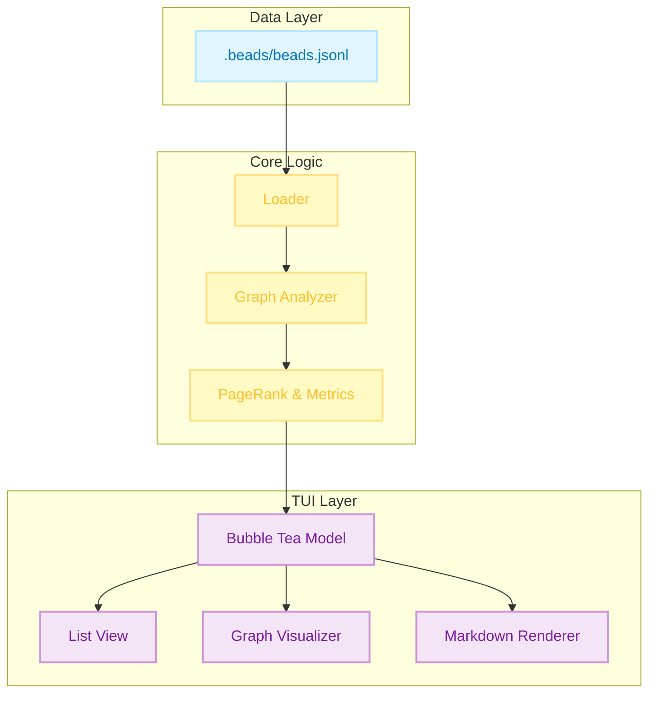
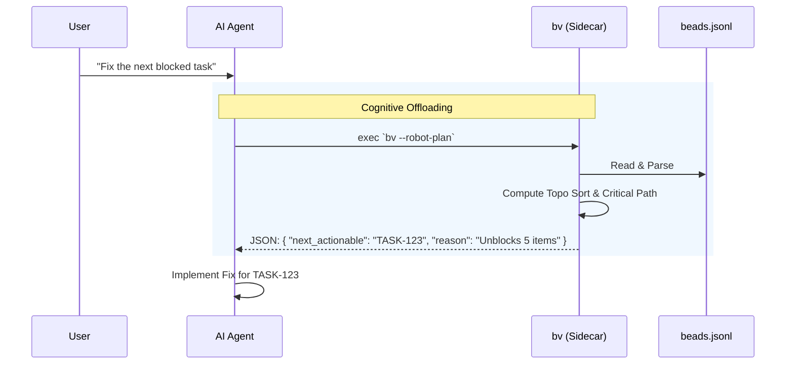
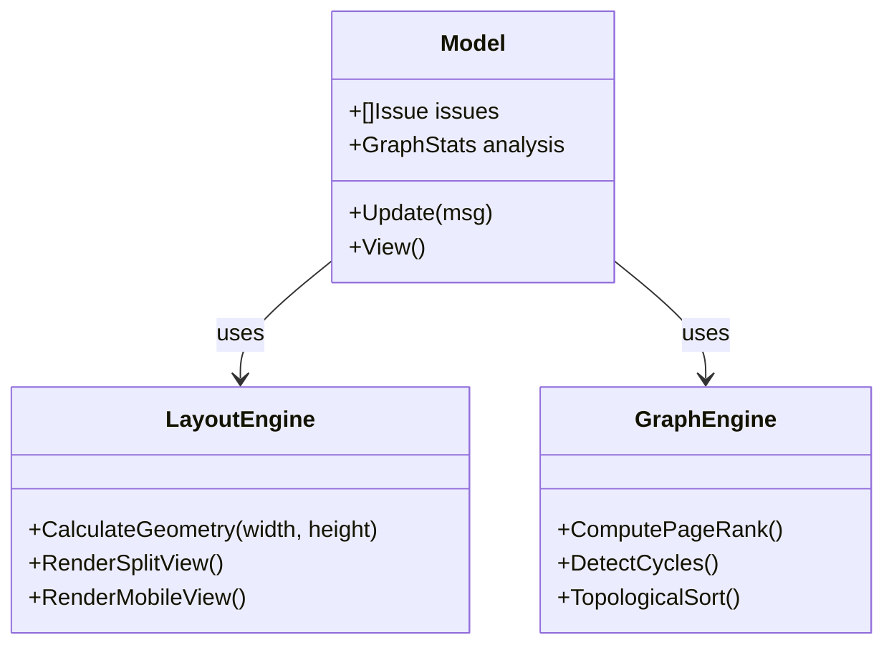

# Beads Viewer (bv)


### ⚡ Quick Install

```bash
curl -fsSL https://raw.githubusercontent.com/Dicklesworthstone/beads_viewer/main/install.sh | bash
```

---

## 💡 TL;DR

`bv` is a high-performance **Terminal User Interface (TUI)** for browsing and managing tasks in projects that use the **Beads** issue tracking system. 

**Why you'd care:**
*   **Speed:** Browse thousands of issues instantly with zero network latency.
*   **Focus:** Stay in your terminal and use Vim-style keys (`j`/`k`) to navigate.
*   **Intelligence:** It visualizes your project as a **dependency graph**, automatically highlighting bottlenecks, cycles, and critical paths that traditional list-based trackers miss.
*   **AI-Ready:** It provides structured, pre-computed insights for AI coding agents, acting as a "brain" for your project's task management.

---

## 📖 The Core Experience

At its heart, `bv` is about **viewing your work nicely**.

### ⚡ Fast, Fluid Browsing
No web page loads, no heavy clients. `bv` starts instantly and lets you fly through your issue backlog using standard Vim keys (`j`/`k`).
*   **Split-View Dashboard:** On wider screens, see your list on the left and full details on the right.
*   **Markdown Rendering:** Issue descriptions, comments, and notes are beautifully rendered with syntax highlighting, headers, and lists.
*   **Instant Filtering:** Zero-latency filtering. Press `o` for Open, `c` for Closed, or `r` for Ready (unblocked) tasks.

### 🔎 Rich Context
Don't just read the title. `bv` gives you the full picture:
*   **Comments & History:** Scroll through the full conversation history of any task.
*   **Metadata:** Instantly see Assignees, Labels, Priority badges, and creation dates.
*   **Search:** Powerful fuzzy search (`/`) finds issues by ID, title, or content instantly.

### 🎯 Focused Workflows
*   **Kanban Board:** Press `b` to switch to a columnar view (Open, In Progress, Blocked, Closed) to visualize flow.
*   **Visual Graph:** Press `g` to explore the dependency tree visually.
*   **Insights:** Press `i` to see graph metrics and bottlenecks.
*   **Ultra-Wide Mode:** On large monitors, the list expands to show extra columns like sparklines and label tags.

---

## 📐 Architecture & Design

`bv` treats your project as a **Directed Acyclic Graph (DAG)**, not just a list. This allows it to derive insights about what is *truly* important.



### Key Metrics
*   **PageRank:** Identifies "foundational" tasks that many others depend on.
*   **Betweenness Centrality:** Highlights "bottleneck" tasks that bridge different parts of the system.
*   **Critical Path:** Calculates the longest path of dependencies to find tasks that directly impact delivery time.

### 1. PageRank (Dependency Authority)
**The Math:** Originally designed to rank web pages by "importance" based on incoming links, PageRank models a "random surfer" walking the graph. In our dependency graph ($u \rightarrow v$ implies $u$ depends on $v$), we treat dependencies as "votes" of importance.
$$
PR(v) = \frac{1-d}{N} + d \sum_{u \in M(v)} \frac{PR(u)}{L(u)}
$$

**Pragmatic Meaning:** **Foundational Blocks.** High PageRank tasks are the bedrock of your project. They are rarely "features" in the user-facing sense; they are often schemas, core libraries, or architectural decisions. Breaking them breaks the graph.

### 2. Betweenness Centrality (Bottlenecks)
**The Math:** Defined as the fraction of all shortest paths in the network that pass through a given node $v$.
$$C_B(v) = \sum_{s \neq v \neq t} \frac{\sigma_{st}(v)}{\sigma_{st}}$$

**Pragmatic Meaning:** **Gatekeepers & Bottlenecks.** A task with high Betweenness is a choke point. It might be an API contract that both the mobile app and the server team are waiting on.

### 3. HITS (Hubs & Authorities)
**The Intuition:** This models a "mutually reinforcing" relationship. Good libraries (Authorities) are used by many applications. Good applications (Hubs) use many good libraries.

**Pragmatic Meaning:** **Epics vs. Infrastructure.**
*   **High Hub Score:** These are your **Epics** or **Product Features**. They aggregate many dependencies to deliver value.
*   **High Authority Score:** These are your **Utilities**. They provide value to many consumers.

### 4. Critical Path (Longest Path in DAG)
**The Math:** In a DAG, the longest path represents the minimum time required to complete the project (assuming infinite parallelism). `bv` computes this recursively:
$$Impact(u) = 1 + \max(\{Impact(v) \mid u \rightarrow v\})$$

**Pragmatic Meaning:** **Keystones.** A Keystone task is one where *any* delay translates 1:1 into a delay for the final project delivery. These tasks have zero "slack."

---

## 🤖 The Robot Protocol (AI Interface)

`bv` bridges the gap between raw data and AI agents. Agents struggle with graph algorithms; `bv` solves this by acting as a deterministic "sidecar" that offloads the cognitive burden of graph traversal.



### The "Cognitive Offloading" Strategy
The primary design goal of the Robot Protocol is **Cognitive Offloading**.
Large Language Models (LLMs) are probabilistic engines; they are excellent at semantic reasoning (coding, writing) but notoriously unreliable at algorithmic graph traversal (finding cycles, computing shortest paths).

If you feed an Agent raw `beads.jsonl` data, you are forcing the Agent to:
1.  Parse thousands of lines of JSON.
2.  Reconstruct the dependency graph in its context window.
3.  "Hallucinate" a path traversal or cycle check.

`bv` solves this by providing a deterministic graph engine sidecar.

### Agent Usage Patterns
Agents typically use `bv` in three phases:

1.  **Triage & Orientation:**
    Before starting a session, the agent runs `bv --robot-insights`. It receives a lightweight JSON summary of the project's structural health. It immediately knows:
    *   "I should not work on Task C yet because it depends on Task B, which is a Bottleneck."
    *   "The graph has a cycle (A->B->A); I must fix this structural error before adding new features."

2.  **Impact Analysis:**
    When asked to "refactor the login module," the agent checks the **PageRank** and **Impact Scores** of the relevant beads. If the scores are high, the agent knows this is a high-risk change with many downstream dependents, prompting it to run more comprehensive tests.

3.  **Execution Planning:**
    Instead of guessing the order of operations, the agent uses `bv`'s topological sort to generate a strictly linearized plan.

**JSON Output Schema:**
The output is designed to be strictly typed and easily parseable by tools like `jq` or standard JSON libraries.
```json
{
  "bottlenecks": [
    { "id": "CORE-123", "value": 0.45, "desc": "High Betweenness" }
  ],
  "keystones": [
    { "id": "API-001", "value": 12.0, "desc": "High Impact Depth" }
  ],
  "cycles": [
    ["TASK-A", "TASK-B", "TASK-A"]
  ],
  "density": 0.045
}
```

---

## 🎨 TUI Engineering & Craftsmanship

`bv` is built with the **Bubble Tea** framework, ensuring a glitch-free, 60fps experience. It features an adaptive layout engine that responds to terminal resize events and a custom ASCII/Unicode graph renderer.



### 1. Adaptive Layout Engine
`bv` doesn't just dump text; it calculates geometry on every render cycle.
*   **Dynamic Resizing:** The `View()` function inspects the current terminal width (`msg.Width`) on every frame.
*   **Breakpoint Logic:**
    *   `< 100 cols`: **Mobile Mode**. List takes 100% width.
    *   `> 100 cols`: **Split Mode**. List takes 40%, Details take 60%.
    *   `> 140 cols`: **Ultra-Wide**. List injects extra columns (Sparklines, Labels) that are normally hidden.
*   **Padding Awareness:** The layout engine explicitly accounts for borders (2 chars) and padding (2 chars) to prevent "off-by-one" wrapping errors that plague many TUIs.

### 2. Zero-Latency Virtualization
Rendering 10,000 issues would choke a naive terminal app. `bv` implements **Viewport Virtualization**:
*   **Windowing:** We only render the slice of rows currently visible in the terminal window.
*   **Pre-Computation:** Graph metrics (PageRank, etc.) are computed *once* at startup in a separate goroutine, not on every frame.
*   **Detail Caching:** The Markdown renderer is instantiated lazily and reused, avoiding expensive regex recompilation.

### 3. Visual Graph Engine (`pkg/ui/graph.go`)
We built a custom 2D ASCII/Unicode rendering engine from scratch to visualize the dependency graph.
*   **Canvas Abstraction:** A 2D grid of `rune` cells and `style` pointers allows us to draw "pixels" in the terminal.
*   **Manhattan Routing:** Edges are drawn using orthogonal lines with proper Unicode corner characters ( `╭`, `─`, `╮`, `│`, `╰`, `╯`) to minimize visual noise.
*   **Topological Layering:** Nodes are arranged in layers based on their "Impact Depth," ensuring that dependencies always flow downwards.

---

## 📈 Visual Data Encoding: Sparklines & Heatmaps

In dense information environments like the terminal, text is expensive. `bv` employs high-density data visualization techniques (`pkg/ui/visuals.go`) inspired by Edward Tufte to convey complex metrics in minimal space.

### 1. Unicode Sparklines
When viewing the list in Ultra-Wide mode, `bv` renders a "Graph Score" column using Unicode block characters (` `, `▂`, `▃`, `▄`, `▅`, `▆`, `▇`, `█`).
*   **The Math:** `RenderSparkline(val, width)` normalizes a float value (0.0 - 1.0) against the available character width. It calculates the precise block height for each character cell to create a continuous bar chart effect.
*   **The Utility:** This allows you to scan a list of 50 issues and instantly spot the "spikes" in complexity or centrality without reading a single number.

### 2. Semantic Heatmaps
We don't just use random colors. `pkg/ui/visuals.go` implements a perceptually uniform color ramp (`GetHeatmapColor`) that maps metric intensity to a gradient:
*   `0.0 - 0.2`: **Low** (Gray/Dim)
*   `0.2 - 0.5`: **Mid** (Blue/Cool)
*   `0.5 - 0.8`: **High** (Purple/Warm)
*   `0.8 - 1.0`: **Peak** (Pink/Hot)
This visual encoding is applied to badges in the Insights Dashboard, allowing you to differentiate between "somewhat important" and "critically urgent" tasks at a glance.

---

## 🔍 Search Architecture

In a project with thousands of issues, you cannot afford to wait for a backend query. `bv` implements a **composite, in-memory fuzzy search** that feels instantaneous.

### The "Flattened Vector" Index
Instead of searching fields individually (which requires complex UI controls), `bv` flattens every issue into a single searchable "vector" at load time.
The `FilterValue()` method constructs a composite string containing:
*   **Core Identity:** ID (`"CORE-123"`) and Title (`"Fix login race condition"`)
*   **Metadata:** Status (`"open"`), Type (`"bug"`), Priority
*   **Context:** Assignee (`"@steve"`) and Labels (`"frontend, v1.0"`)

### Fuzzy Subsequence Matching
When you press `/`, the search engine performs a **fuzzy subsequence match** against this composite vector.
*   **Example:** Typing `"log fix"` successfully matches `"Fix login race condition"`.
*   **Example:** Typing `"steve bug"` finds bugs assigned to Steve.
*   **Example:** Typing `"open v1.0"` filters for open items in the v1.0 release.

---

## 📄 The Status Report Engine

`bv` isn't just for personal browsing; it's a communication tool. The `--export-md` flag generates a **Management-Ready Status Report** that converts your repo state into a polished document suitable for stakeholders.

### 1. The "Hybrid Document" Architecture
The exporter (`pkg/export/markdown.go`) constructs a document that bridges human readability and visual data:
*   **Summary at a Glance:** Top-level statistics (Total, Open, Blocked, Closed) give immediate health context.
*   **Embedded Graph:** It injects the full dependency graph as a Mermaid diagram *right into the document*. On platforms like GitHub or GitLab, this renders as an interactive chart.
*   **Anchor Navigation:** A generated Table of Contents uses URL-friendly slugs (`#core-123-refactor-login`) to link directly to specific issue details, allowing readers to jump between the high-level graph and low-level specs.

### 2. Semantic Formatting
We don't just dump JSON values. The exporter applies specific formatting rules to ensure the report looks professional:
*   **Metadata Tables:** Key fields (Assignee, Priority, Status) are aligned in GFM (GitHub Flavored Markdown) tables with emoji indicators.
*   **Conversation threading:** Comments are rendered as blockquotes (`>`) with relative timestamps, preserving the flow of discussion distinct from the technical spec.
*   **Intelligent Sorting:** The report doesn't list issues ID-sequentially. It applies the same priority logic as the TUI: **Open Critical** issues appear first, ensuring the reader focuses on what matters now.

---

## 🧪 Quality Assurance & Robustness

Trust is earned. `bv` employs a rigorous testing strategy to ensure it can handle the messy reality of real-world repositories.

### 1. Synthetic Data Fuzzing
We don't just test on "happy path" data. The test suite (`pkg/loader/synthetic_test.go`) generates **Synthetic Complex Graphs**—large JSONL files with thousands of nodes, intricate dependency cycles, and edge-case UTF-8 characters—to verify that the graph engine and rendering logic never panic under load.

### 2. Robustness Against Corruption
In a git-based workflow, merge conflicts and partial writes happen. The `TestLoadIssuesRobustness` suite explicitly injects garbage lines and corrupted JSON into the data stream.
*   **Result:** `bv` detects corruption, logs a warning to `stderr`, and continues loading the valid data. It never crashes the user session due to a single bad line.

---

## 🔄 The Zero-Friction Update Engine

`bv` includes a proactive, non-intrusive update check to ensure you never miss a feature. We believe tools should maintain themselves without interrupting your flow.

### Design & Implementation
The updater (`pkg/updater/updater.go`) is architected for silence and safety:
1.  **Non-Blocking Concurrency:** The check runs in a detached goroutine with a strict **2-second timeout**. It never delays your startup time or UI interactivity.
2.  **Semantic Versioning:** It doesn't just match strings. A custom SemVer comparator ensures you are only notified about strictly *newer* releases, handling complex edge cases like release candidates vs. stable builds.
3.  **Resilience:** It gracefully handles network partitions, GitHub API rate limits (403/429), and timeouts by silently failing. You will never see a crash or error log due to an update check.
4.  **Unobtrusive Notification:** When an update is found, `bv` doesn't pop a modal. It simply renders a subtle **Update Available** indicator (`⭐`) in the footer, letting you choose when to upgrade.

---

## 🗂️ Data Loading & Self-Healing

Reliability is key. `bv` doesn't assume a perfect environment; it actively handles common file system inconsistencies.

### 1. Intelligent Path Discovery
The loader (`pkg/loader/loader.go`) doesn't just blindly open `.beads/beads.jsonl`. It employs a priority-based discovery algorithm:
1.  **Canonical:** Checks for `beads.jsonl`.
2.  **Legacy:** Fallback to `issues.jsonl` for older repos.
3.  **Base:** Checks `beads.base.jsonl` (used by `bd` in daemon mode).
4.  **Validation:** It skips temporary files like `*.backup` or `deletions.jsonl` to prevent displaying corrupted state.

### 2. Robust Parsing
The JSONL parser is designed to be **Lossy-Tolerant**.
*   It uses a buffered scanner (`bufio.NewScanner`) with a generous 10MB line limit to handle massive description blobs.
*   Malformed lines (e.g., from a merge conflict) are skipped with a warning rather than crashing the application, ensuring you can still view the readable parts of your project even during a bad git merge.

---

## 🧩 Design Philosophy: Why Graphs?

Traditional issue trackers (Jira, GitHub Issues, Trello) model work as **Buckets**: "To Do", "In Progress", "Done". This is fine for simple task lists, but it fails at scale because it ignores **Structure**.

In complex software projects, tasks are not isolated. They are deeply interconnected. A "simple" frontend task might depend on a backend endpoint, which depends on a schema change, which depends on a migration script.

`bv` adopts a **Graph-First** philosophy:
1.  **Structure is Reality:** The dependency graph *is* the project. The list view is just a projection of that graph.
2.  **Explicit Blocking:** We don't just "relate" tasks; we define strict "blocks". If A blocks B, you literally cannot mark B as "Ready" in `bv` until A is Closed.
3.  **Local-First, Text-Based:** Your project data lives in your repo (`.beads/beads.jsonl`), not on a remote server. It travels with your code, branches with your git, and merges with your PRs.

---

## ⚡ Performance Specs

`bv` is engineered for speed. We believe that latency is the enemy of flow.

*   **Startup Time:** < 50ms for typical repos (< 1000 issues).
*   **Rendering:** 60 FPS UI updates using [Bubble Tea](https://github.com/charmbracelet/bubbletea).
*   **Virtualization:** List views and Markdown renderers are fully windowed. `bv` can handle repositories with **10,000+ issues** without UI lag, consuming minimal RAM.
*   **Graph Compute:** The analysis engine runs in a separate goroutine, pre-calculating metrics for thousands of nodes in sub-second time on standard hardware.

---

## ❓ Troubleshooting & FAQ

**Q: My icons look weird / text is misaligned.**
*   `bv` requires a terminal with **TrueColor** support and a **Nerd Font** installed.
*   *Recommended:* [Nerd Fonts](https://www.nerdfonts.com/) (e.g., "JetBrains Mono Nerd Font" or "Hack Nerd Font").
*   *Terminals:* Windows Terminal, iTerm2, Alacritty, Kitty, WezTerm.

**Q: I see "Cycles Detected" in the dashboard. What now?**
A: A cycle (e.g., A → B → A) means your project logic is broken; no task can be finished first. Use the Insights Dashboard (`i`) to find the specific cycle members, then use `bd` to remove one of the dependency links (e.g., `bd unblock A --from B`).

**Q: Does this work with Jira/GitHub?**
A: `bv` is data-agnostic. The Beads data schema supports an `external_ref` field. If you populate your `.beads/beads.jsonl` file with issues from external trackers (e.g., using a custom script or sync tool), `bv` will render them alongside your local tasks. Future versions of the `bd` CLI may support native syncing, but `bv` is ready for that data today.

---

## 📦 Installation

### One-Line Install
The fastest way to get started. Detects your OS and architecture automatically.

```bash
curl -fsSL https://raw.githubusercontent.com/Dicklesworthstone/beads_viewer/main/install.sh | bash
```

### Build from Source
Requires Go 1.21+.

```bash
git clone https://github.com/Dicklesworthstone/beads_viewer.git
cd beads_viewer
go install ./cmd/bv
```

---

## 🚀 Usage Guide

Navigate to any project initialized with `bd init` and run:

```bash
bv
```

### Keyboard Control Map

| Context | Key | Action |
| :--- | :---: | :--- |
| **Navigation** | `j` / `k` | Next / Previous Item |
| | `Tab` | Switch Focus (List ↔ Details) |
| | `Enter` | Open / Focus Selection |
| | `q` | Quit / Back |
| **Filters** | `o` | Show **Open** Issues |
| | `r` | Show **Ready** (Unblocked) |
| | `c` | Show **Closed** Issues |
| | `/` | **Search** (Fuzzy) |
| **Views** | `b` | Toggle **Kanban Board** |
| | `i` | Toggle **Insights Dashboard** |
| | `g` | Toggle **Graph Visualizer** |
| **Global** | `?` | Toggle Help Overlay |

---

## 🛠️ Configuration

`bv` automatically detects your terminal capabilities to render the best possible UI. It looks for `.beads/beads.jsonl` in your current directory.

### Visual Theme
The UI uses a visually distinct, high-contrast theme inspired by Dracula Principles to ensure readability.
*   **Primary:** `#BD93F9` (Purple)
*   **Status Open:** `#50FA7B` (Green)
*   **Status Blocked:** `#FF5555` (Red)

---

## 🤝 Contributing

We welcome contributions! Please see `AGENTS.md` for guidelines on our AI-first development workflow.

## 📄 License

MIT License

Copyright (c) 2025 Jeffrey Emanuel

Permission is hereby granted, free of charge, to any person obtaining a copy
of this software and associated documentation files (the "Software"), to deal
in the Software without restriction, including without limitation the rights
to use, copy, modify, merge, publish, distribute, sublicense, and/or sell
copies of the Software, and to permit persons to whom the Software is
furnished to do so, subject to the following conditions:

The above copyright notice and this permission notice shall be included in all
copies or substantial portions of the Software.

THE SOFTWARE IS PROVIDED "AS IS", WITHOUT WARRANTY OF ANY KIND, EXPRESS OR
IMPLIED, INCLUDING BUT NOT LIMITED TO THE WARRANTIES OF MERCHANTABILITY,
FITNESS FOR A PARTICULAR PURPOSE AND NONINFRINGEMENT. IN NO EVENT SHALL THE
AUTHORS OR COPYRIGHT HOLDERS BE LIABLE FOR ANY CLAIM, DAMAGES OR OTHER
LIABILITY, WHETHER IN AN ACTION OF CONTRACT, TORT OR OTHERWISE, ARISING FROM,
OUT OF OR IN CONNECTION WITH THE SOFTWARE OR THE USE OR OTHER DEALINGS IN THE
SOFTWARE.